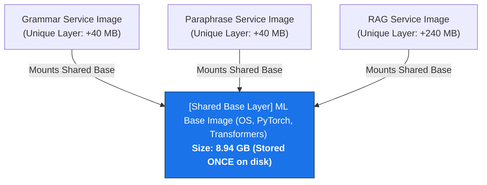

# Docker Microservices Optimization & Layer Sharing Architecture

This document explains how the AI Writing Assistant microservice architecture was optimized to eliminate redundant dependency downloads (such as PyTorch and Transformers) and drastically reduce physical disk utilization on the deployment host.

---

## 1. The Core Problem (Monolithic / Independent Builds)

Previously, all microservices (`grammar`, `paraphrase`, `simplify`, `tone`, `summarize`, and `rag`) were built independently directly from a minimal base image. Each microservice's `Dockerfile` was structured as follows:

```dockerfile
FROM python:3.11-slim

ARG SERVICE_NAME
WORKDIR /app

# Redundant compiler dependencies installed on every build
RUN apt-get update && apt-get install -y --no-install-recommends \
    build-essential curl \
    && rm -rf /var/lib/apt/lists/*

COPY services/${SERVICE_NAME}/requirements.txt .
RUN pip install --no-cache-dir -r requirements.txt  # <-- BUSTED CACHE STEP
```

### The Consequences
1. **Cache Busting on Requirements Copy:** Because the build context copied different `requirements.txt` files based on the dynamic `${SERVICE_NAME}` build argument, Docker was forced to treat this step as unique for each service.
2. **Redundant Network Transfers:** Every single microservice had to individually download the heavy PyTorch (`~2.5GB` with CUDA dependencies) and Hugging Face Transformers packages.
3. **SSD Bloat (Multiplied Storage):** Because each image was built in isolation, Docker stored independent copies of the heavy ML libraries. With 6 microservices running ML models, this resulted in **~54GB of identical, duplicated data** on the SSD.

---

## 2. The Optimized Architecture (Shared Ancestry)

To solve this, we decoupled the heavy, common Machine Learning base dependencies from the service-specific application logic by creating a **Unified ML Cache Layer**.

```
                           [ python:3.11-slim ] (Base OS Layer)
                                     │
                                     ▼
                [ writing-assistant-ml-base:latest ] (Common ML Layer)
               (Pre-compiled PyTorch, Transformers, PEFT, Tokenizers)
                                     │
         ┌───────────────────────────┼───────────────────────────┐
         ▼                           ▼                           ▼
[ grammar-service ]        [ paraphrase-service ]        [ rag-service ]
 (App Logic + PEFT)          (App Logic + PEFT)       (App Logic + Celery)
```

### Step 1: The Shared ML Base Image (`Dockerfile.ml-base`)
We created a specialized base image at `infra/docker/Dockerfile.ml-base` containing only the foundational system utilities and heavy ML libraries:

```dockerfile
FROM python:3.11-slim

RUN apt-get update && apt-get install -y --no-install-recommends \
    build-essential curl tzdata \
    && rm -rf /var/lib/apt/lists/*

# Statically pre-install PyTorch (GPU/CUDA enabled)
RUN pip install --no-cache-dir torch torchvision

# Statically pre-install Hugging Face and GenAI dependencies
RUN pip install --no-cache-dir transformers accelerate peft sentence-transformers
```
This base image compiles and downloads the heavy packages **exactly once** during the build stage of the `ml-base` target.

### Step 2: Lightweight Service Dockerfile (`Dockerfile.service`)
We refactored the microservices' main Dockerfile to inherit directly from the cached base image instead of raw Python:

```dockerfile
FROM writing-assistant-ml-base:latest

ARG SERVICE_NAME
WORKDIR /app

# Only copies light, service-specific packages (e.g., prometheus-client, qdrant-client)
COPY services/${SERVICE_NAME}/requirements.txt .
RUN pip install --no-cache-dir -r requirements.txt

COPY services/${SERVICE_NAME}/app ./app
COPY shared ./shared
```

---

## 3. How Docker Resolves This (Under the Hood)

This multi-stage architecture utilizes two core concepts of the Docker engine: **Layer Caching** and the **OverlayFS Storage Driver**.

### A. How it Stops Redundant Downloads (Build Cache)
When Docker builds `grammar-service`, it executes the statement `FROM writing-assistant-ml-base:latest`.
* Docker detects that the `writing-assistant-ml-base` image already exists locally in the host system's engine cache.
* It completely bypasses the compilation and installation steps for PyTorch and Transformers.
* The only network activity occurs when resolving the remaining lightweight dependencies in the service-specific `requirements.txt` (which takes less than 2 seconds).

### B. How it Saves SSD Space (OverlayFS Layer Sharing)
Docker images are stored on disk as a stack of immutable, read-only layers. 

When you build the 6 ML-dependent services:
1. The **Base OS & ML Layers** (containing Python, CUDA, PyTorch, and Transformers) comprise **8.94 GB** of read-only data. This layer stack is physically stored on your SSD **only once**.
2. When the microservices are built, they generate their own lightweight layers containing only their specific `/app` code and minor additional libraries.
3. The **OverlayFS storage driver** dynamically mounts the shared, read-only base layers and overlays the unique service-specific layers on top of them.



### Result
* **Virtual Image Size (What the container sees):** `~9.18 GB` per microservice.
* **Physical Disk Footprint (What is actually stored on SSD):** `~9.5 GB` for the **entire fleet of 6 microservices combined**, rather than the **~58 GB** required by independent, un-shared images.
